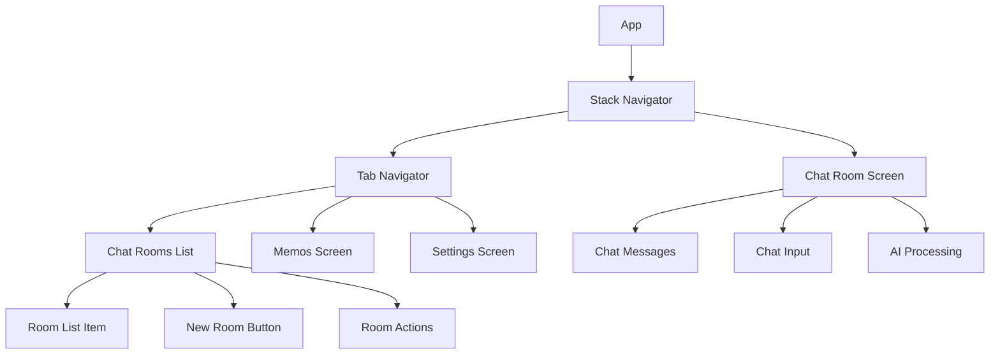

# 다중 채팅방 기능 설계

## 개요

현재 MemoApp은 단일 채팅방 구조로 되어 있으며, 모든 채팅 메시지와 메모가 하나의 공간에서 관리됩니다. 다중 채팅방 기능을 추가하여 사용자가 주제별로 대화를 분리하고 관리할 수 있도록 개선합니다.

## 아키텍처

### 현재 구조 분석

**데이터 저장:**
- `chatMessages`: 모든 채팅 메시지를 단일 배열로 저장
- `memos`: 모든 메모를 단일 배열로 저장
- AsyncStorage를 사용한 로컬 저장

**컴포넌트 구조:**
- `ChatScreenRefactored`: 메인 채팅 화면
- `useChat`: 채팅 데이터 관리 훅
- `TabNavigator`: 하단 탭 네비게이션 (Chat, Memos, Settings)

### 새로운 아키텍처



## 컴포넌트 및 인터페이스

### 1. 데이터 모델

#### ChatRoom 인터페이스
```typescript
interface ChatRoom {
  id: string;
  title: string;
  createdAt: Date;
  updatedAt: Date;
  lastMessage?: {
    content: string;
    timestamp: Date;
    type: 'user' | 'ai' | 'record';
  };
  messageCount: number;
  memoCount: number;
}
```

#### 수정된 ChatMessage 인터페이스
```typescript
interface ChatMessage {
  id: string;
  roomId: string; // 새로 추가
  content: string;
  timestamp: Date;
  type: 'user' | 'ai' | 'record';
  memoStatus?: 'active' | 'deleted' | 'permanentlyDeleted';
}
```

#### 수정된 Memo 인터페이스
```typescript
interface Memo {
  id: string;
  roomId: string; // 새로 추가
  content: string;
  timestamp: Date;
}
```

### 2. 새로운 컴포넌트

#### ChatRoomsListScreen
- 채팅방 목록을 표시하는 메인 화면
- 새 채팅방 생성 버튼
- 각 채팅방의 미리보기 정보 표시
- 스와이프 액션으로 편집/삭제 기능

#### ChatRoomItem
- 개별 채팅방을 표시하는 리스트 아이템
- 제목, 마지막 메시지, 시간, 메시지/메모 개수 표시
- 길게 누르기로 컨텍스트 메뉴 표시

#### ChatRoomHeader
- 채팅방 화면의 헤더
- 채팅방 제목 표시 및 편집 기능
- 뒤로 가기 버튼

### 3. 수정된 컴포넌트

#### ChatScreenRefactored → ChatRoomScreen
- roomId를 props로 받아 특정 채팅방의 데이터만 로드
- 헤더에 채팅방 제목 표시
- 뒤로 가기 시 채팅방 목록으로 이동

#### useChat → useChatRoom
- roomId 기반으로 데이터 필터링
- 채팅방별 메시지 로드/저장
- 채팅방 메타데이터 업데이트

### 4. 새로운 훅

#### useChatRooms
```typescript
interface UseChatRooms {
  chatRooms: ChatRoom[];
  createRoom: (title?: string) => Promise<ChatRoom>;
  updateRoom: (roomId: string, updates: Partial<ChatRoom>) => Promise<void>;
  deleteRoom: (roomId: string) => Promise<void>;
  getCurrentRoom: () => ChatRoom | null;
  setCurrentRoom: (roomId: string) => void;
}
```

## 데이터 모델

### AsyncStorage 키 구조

**기존:**
- `chatMessages`: ChatMessage[]
- `memos`: Memo[]
- `trashedMemos`: Memo[]

**새로운 구조:**
- `chatRooms`: ChatRoom[]
- `chatMessages_${roomId}`: ChatMessage[]
- `memos_${roomId}`: Memo[]
- `trashedMemos_${roomId}`: Memo[]
- `currentRoomId`: string
- `appSettings`: { lastUsedRoomId?: string }

### 데이터 마이그레이션 전략

1. **버전 체크**: 앱 시작 시 데이터 버전 확인
2. **기본 채팅방 생성**: 기존 데이터를 "기본 채팅방"으로 마이그레이션
3. **데이터 이전**: 
   - 기존 `chatMessages` → `chatMessages_defaultRoom`
   - 기존 `memos` → `memos_defaultRoom`
4. **메타데이터 생성**: 기본 채팅방의 ChatRoom 객체 생성

## 에러 처리

### 데이터 무결성
- 채팅방 삭제 시 관련 메시지/메모 정리
- 고아 메시지/메모 감지 및 처리
- 마이그레이션 실패 시 롤백 메커니즘

### 사용자 경험
- 네트워크 오류 시 로컬 데이터 우선 표시
- 데이터 로딩 중 스켈레톤 UI 표시
- 삭제 확인 다이얼로그로 실수 방지

## 테스트 전략

### 단위 테스트
- `useChatRooms` 훅의 CRUD 기능
- 데이터 마이그레이션 로직
- 메시지/메모 필터링 로직

### 통합 테스트
- 채팅방 생성부터 메시지 전송까지의 플로우
- 채팅방 간 데이터 격리 확인
- AI 도구의 채팅방별 데이터 접근

### 사용자 테스트
- 기존 사용자의 데이터 마이그레이션 시나리오
- 다중 채팅방 간 전환 사용성
- 채팅방 관리 기능의 직관성

## 네비게이션 구조 변경

### 현재 구조
```
TabNavigator
├── Chat (ChatScreenRefactored)
├── Memos (MemosScreen)  
└── Settings (SettingsScreen)
```

### 새로운 구조
```
StackNavigator
├── TabNavigator
│   ├── ChatRooms (ChatRoomsListScreen)
│   ├── Memos (MemosScreen - 수정됨)
│   └── Settings (SettingsScreen)
└── ChatRoom (ChatRoomScreen)
```

### 네비게이션 플로우
1. 앱 시작 → ChatRoomsListScreen
2. 채팅방 선택 → ChatRoomScreen (roomId 전달)
3. 뒤로 가기 → ChatRoomsListScreen
4. 새 채팅방 생성 → 새 ChatRoomScreen

## 성능 최적화

### 메모리 관리
- 현재 채팅방의 메시지만 메모리에 로드
- 채팅방 전환 시 이전 채팅방 데이터 언로드
- 대용량 채팅방의 페이지네이션

### 저장소 최적화
- 채팅방별 데이터 분리로 읽기/쓰기 성능 향상
- 메타데이터 캐싱으로 목록 로딩 속도 개선
- 백그라운드에서 데이터 정리 작업

## AI 도구 통합

### MemoTools 수정
- 모든 도구 함수에 `roomId` 매개변수 추가
- 채팅방별 메모 필터링 로직 적용
- 전체 채팅방 검색 옵션 제공

### 컨텍스트 관리
- AI 응답 생성 시 현재 채팅방의 컨텍스트만 사용
- 채팅방별 대화 히스토리 관리
- 크로스 채팅방 참조 기능 (선택사항)

## 사용자 인터페이스

### 채팅방 목록 화면
- 카드 형태의 채팅방 리스트
- 각 카드에 제목, 미리보기, 시간, 개수 표시
- 플로팅 액션 버튼으로 새 채팅방 생성
- 스와이프 제스처로 편집/삭제

### 채팅방 화면
- 기존 ChatScreenRefactored와 유사한 UI
- 헤더에 채팅방 제목과 편집 버튼
- 뒤로 가기 버튼으로 목록 화면 복귀

### 반응형 디자인
- 태블릿에서는 마스터-디테일 레이아웃 고려
- 폰에서는 스택 네비게이션 유지
- 다크 모드 지원 유지

## 보안 및 프라이버시

### 데이터 보호
- 채팅방별 데이터 암호화 (선택사항)
- 민감한 정보 로컬 저장소 보호
- 앱 백그라운드 시 화면 보호

### 사용자 제어
- 채팅방별 데이터 내보내기
- 선택적 채팅방 백업/복원
- 완전 삭제 옵션 제공